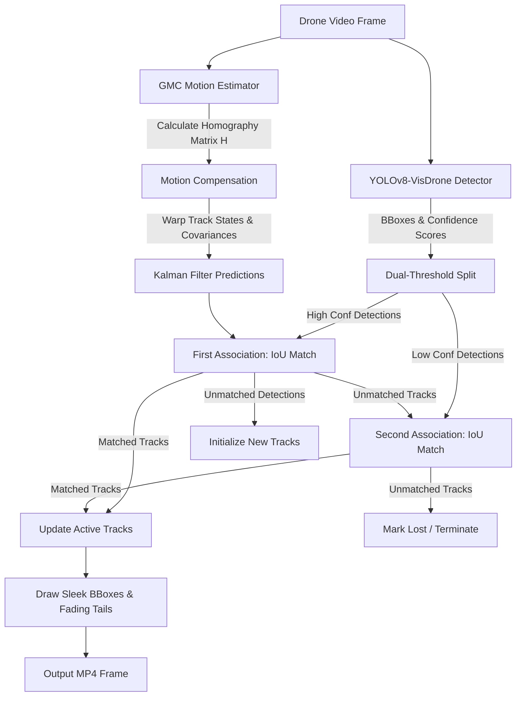

# The Aerial Guardian: Drone-Optimized Person Tracker

A lightweight, real-time computer vision pipeline optimized to detect and track **Persons** (pedestrians and people) from a moving drone platform. 

The pipeline addresses two major drone-specific tracking challenges:
1. **Camera Ego-Motion (Ego-Noise):** Background shifts caused by drone roll, pitch, yaw, and translation confuse standard motion-based trackers (like SORT). We solve this using **Global Motion Compensation (GMC)** via ORB feature matching and Homography estimation.
2. **Small Scale & Occlusions:** Drones at high altitudes capture targets that are extremely small (few pixels wide). We resolve this using **high-resolution inference (`imgsz=1080`)** paired with **dual-threshold data association (ByteTrack logic)** to recover low-confidence target detections.

---

## Technical Architecture



### 1. Detection (Small-Scale Object Optimization)
*   **Base Detector:** We utilize a pre-trained `YOLOv8s` model fine-tuned on the VisDrone dataset (`mshamrai/yolov8s-visdrone`), which weighs only **~22 MB** (well within the 300 MB limit).
*   **Small Object Handling:** 
    *   **Inference Resolution:** We execute inference at **1080p width (`imgsz=1080`)** instead of the standard 640p. This preserves the high-frequency spatial features of small objects, which would otherwise be lost during downsampling.
    *   **Dual-Thresholding:** Detections are divided into high-confidence ($\ge 0.25$) and low-confidence ($[0.10, 0.25)$) pools. Low-confidence detections (which often represent tiny, distant, or partially occluded persons) are not discarded. Instead, they are processed in a second-stage association matching phase.

### 2. Custom Tracking (Ego-Motion & Occlusion Compensation)
*   **Global Motion Compensation (GMC):** 
    *   Between frames $t-1$ and $t$, the pipeline extracts ORB keypoints.
    *   **Foreground Filtering (Adaptation):** To prevent moving vehicles/pedestrians from corrupting camera motion calculations, we mask out the bounding boxes of detected objects. Keypoints are only extracted from the static background.
    *   **Downscaled Estimation:** To keep GMC lightweight, we resize the frame to a width of 640px to perform keypoint extraction and RANSAC homography estimation, then scale the resulting matrix $H$ back to the original resolution. This reduces GMC execution time to **2–5 ms**.
    *   **State Warping:** Before data association, active track states (spatial positions and velocities) and covariance matrices are warped using the homography matrix $H$:
        $$ x' = \text{warp}(x, H) \quad \text{and} \quad P' = M P M^T $$
*   **ByteTrack Association:** Unassociated tracks from the high-confidence match are matched against low-confidence detections using the Hungarian algorithm and Intersection-over-Union (IoU) distance. This maintains ID consistency during occlusions and lighting transitions.

---

## Setup & Running Instructions

### 1. Clone & Setup Environment
Ensure Python 3.10+ is installed. Execute the following commands in your shell:

```bash
# Create a virtual environment
python3 -m venv .venv
source .venv/bin/activate

# Install dependencies
pip install --upgrade pip
pip install -r requirements.txt
```

### 2. Download the Dataset
We have automated the download and extraction of the **VisDrone Task 4 MOT Validation Set** (provided in the challenge link). Run:

```bash
python download_data.py
```
*This downloads the zip file (~400 MB) and extracts it to the `VisDrone2019-MOT-val` directory.*

### 3. Run the Pipeline
To run the tracker on a validation sequence (e.g., `uav0000086_00000_v`), visualize the tracking boxes, and output the annotated video with fading trajectory "tails", run:

```bash
python pipeline.py \
  --sequence VisDrone2019-MOT-val/sequences/uav0000086_00000_v \
  --model mshamrai/yolov8s-visdrone \
  --imgsz 1080 \
  --conf 0.25 \
  --output output/uav0000086_00000_v.mp4
```

### Pipeline Options:
*   `--sequence`: Path to the directory containing sequence frames.
*   `--model`: Name of the YOLOv8 model (`yolov8n-visdrone` / `yolov8s-visdrone` / `yolov8m-visdrone`).
*   `--imgsz`: Width resolution for inference (default: 1080).
*   `--conf`: Detection confidence threshold (default: 0.25).
*   `--output`: Path to write the output MP4 file (default: `output/processed_video.mp4`).
*   `--limit-frames`: Set to a positive integer (e.g., `100`) to process only a subset of frames for quick testing.

---

## Edge Hardware Adaptation (NVIDIA Jetson)

To deploy this tracking pipeline on edge platforms like the **NVIDIA Jetson (Nano, TX2, Orin)**, we would make the following hardware-specific engineering trade-offs:

1.  **TensorRT Model Export:**
    *   Compile the PyTorch YOLO model to **TensorRT** (`.engine`) format using FP16 precision.
    *   On a Jetson Orin Nano, YOLOv8s in TensorRT FP16 format typically runs at **~80+ FPS** (down from ~15 FPS in PyTorch CPU).
    *   If additional performance is required, perform INT8 quantization with calibration using representative validation images.

2.  **Hardware-Accelerated Video Pipeline:**
    *   Use **DeepStream SDK** or OpenCV compiled with **CUDA and GStreamer**.
    *   This offloads image decoding (`nvdec`) and resizing/color conversion (`nvvidconv`) to dedicated Jetson hardware blocks, keeping the CPU completely free for tracker logic.

3.  **GMC Acceleration:**
    *   Replace the OpenCV CPU ORB/RANSAC code with CUDA-accelerated equivalents (`cv2.cuda.ORB` and CUDA homography solvers).
    *   Alternatively, use the optical flow hardware engine on the Jetson to obtain sparse motion vectors, bypassing keypoint extraction entirely.

4.  **Integrated DeepStream Pipeline:**
    *   Deploy the model as a custom Gst-nvinfer plugin in DeepStream.
    *   Use DeepStream's low-overhead native tracking engine (`nvtracker`) configured for IoU/Kalman tracking, injecting our custom homography warp as a pre-association step.

---

## Visual Tracking Demos

All output tracking videos are hosted on Google Drive. You can view or download the tracking results for all processed sequences directly:

📂 **[Google Drive Folder: The Aerial Guardian Outputs](https://drive.google.com/drive/folders/1FDXBIe3wIU5c5EB30KFZU0-hZsjitPbZ?usp=sharing)**

| Sequence | Scenario | File Name | Drive Link |
| --- | --- | --- | --- |
| **UAV Sequence 182** | Dense Person Tracking | `uav0000182_00000_v.mp4` | [View Video ↗](https://drive.google.com/drive/folders/1FDXBIe3wIU5c5EB30KFZU0-hZsjitPbZ?usp=sharing) |
| **UAV Sequence 305** | Low-Altitude Pedestrians | `uav0000305_00000_v.mp4` | [View Video ↗](https://drive.google.com/drive/folders/1FDXBIe3wIU5c5EB30KFZU0-hZsjitPbZ?usp=sharing) |
| **UAV Sequence 086** | Multi-Target Ego-Motion | `uav0000086_00000_v.mp4` | [View Video ↗](https://drive.google.com/drive/folders/1FDXBIe3wIU5c5EB30KFZU0-hZsjitPbZ?usp=sharing) |
| **UAV Sequence 268** | Long-Range / High-Altitude | `uav0000268_05773_v.mp4` | [View Video ↗](https://drive.google.com/drive/folders/1FDXBIe3wIU5c5EB30KFZU0-hZsjitPbZ?usp=sharing) |
| **UAV Sequence 117** | Multiple Small Targets | `uav0000117_02622_v.mp4` | [View Video ↗](https://drive.google.com/drive/folders/1FDXBIe3wIU5c5EB30KFZU0-hZsjitPbZ?usp=sharing) |
| **UAV Sequence 137** | Complex Occlusions | `uav0000137_00458_v.mp4` | [View Video ↗](https://drive.google.com/drive/folders/1FDXBIe3wIU5c5EB30KFZU0-hZsjitPbZ?usp=sharing) |
| **Quick Test Run** | Sample Validation Output | `test_run.mp4` | [View Video ↗](https://drive.google.com/drive/folders/1FDXBIe3wIU5c5EB30KFZU0-hZsjitPbZ?usp=sharing) |


